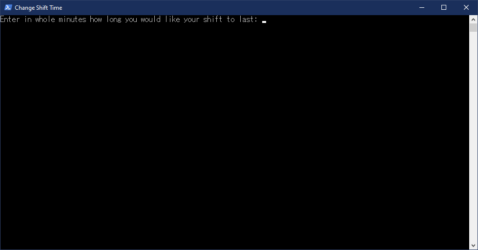

# shipbreaker-shift-mod
This is a mod for the game Hardspace: Shipbreaker that changes the value of the shift timer.

To use the mod, open the **Change Shift Time** file with a double click.
This will open up a prompt asking you how long you would like your shift in minutes.
Enter your desired shift length in whole minutes and press enter.

When the time is changed, a backup of the original game file is made.
If you would like to restore the backup, so that you are using the original game file,
open the **Restore Backup** file with a double click.